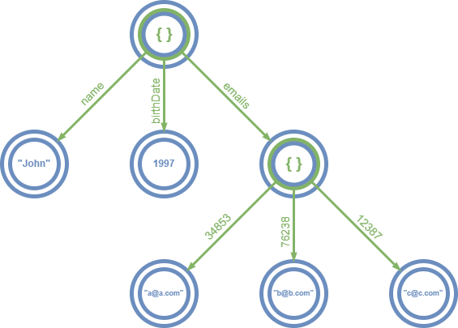

# Struct RX implementation

The main problems this solution aims:
- The basic React-state is tied to the component. The same state can not be used by *multiple* components.
- Complex states have *structure* that needs to be respected by rerenders in order to have straightforward code and reasonable performance.

## Component-independent state
If we only use React-states, than we have to choose a component for every piece of the application state, because the component states are tied to their component. Which component is responsible for which piece of state? For many pieces, the answer is none of them. In practice, state-pieces often have to be independent from components, many complex UIs are hard to implement otherwise. By using only React-states, I experienced, that a small change in the state usage pattern required an API change in child components, which made the children less reusable.

A simple construct can be achieved by implementing a *topic-subscriber* model. A topic represents an atomically managed state and is associated with multiple subscribers. Subscribers can be used with multiple topics as well. When the value of a topic changes, all associated subscribers are notified, so that no changes are missed. 

```
class Subscriber {
  readonly reaction: () => any;
  topics: Topic<any>[] = [];
  constructor(reaction: () => any) {
    this.reaction = reaction;
  }
  notify() {
    this.reaction()
  }
  subscribe() {
    for (const a of this.topics) {
      a.subscribe(this);
    }
  }
  unsubscribe() {
    for (const a of this.topics) {
      a.unsubscribe(this);
    }
  }
}

class Topic<T> {
  private value: T;
  private readonly subscribers = new Set<Subscriber>();
  constructor(value: T) {
    this.value = value;
  }
  get() {
    return this.value;
  }
  set(value: T) {
    const prevValue = this.value;
    this.value = value;
    if (prevValue !== this.value) {
      this.subscribers.forEach((s) => s.notify());
    }
  }
  subscribe(subscriber: Subscriber) {
    this.subscribers.add(subscriber);
  }
  unsubscribe(subscriber: Subscriber) {
    this.subscribers.delete(subscriber);
  }
}
```

A React component should subscribe to topics during initialization, than unsubscribe before unmounting. This can be simplified with a ``useTopicValue`` hook.

```
function useTopicValue<T>(topic: Topic<T>) {
  const subscriber = useRef(new Subscriber(() => {
    setValue(topic.get())
  })).current;
  const [value, setValue] = useState(() => topic.get());
  useEffect(() => {
    subscriber.subscribe();
    return () => {
      subscriber.unsubscribe();
    };
  }, []);
  return value;
}
```

A topic can be used by any of the components:

```
const topic = new Topic(1);

const MyComponent = () => {
  const value = useTopicValue(topic);
  return <div>{value}</div>
}
```

## Structured state
When we need to store complex data with levels of hierarchy, using it efficiently in a topic becomes increasingly difficult as it's size grows. To make the parts of it independent, we may use multiple topics, than hold them together in an object or an array.
```
const reservedSeats: Topic<boolean>[] = []
const preferences = {
  allowNotifications: new Topic(false),
  language: new Topic("en")
}
```
One big problem with this approach is *unsafety*. If a topic in the array is removed (or is substituted for another), the subscribers are not automatically notified. The dependencies of the detached topics are *corrupted*.
In order to solve this, we can put every node of the state in a ``Topic``.

The other big problem is the invasion of the ``Topic`` type. The second variable is meant to be of type ``{allowNotifications: boolean, language: string}``, but it's now 'topicized' to make parts of it reactively dependable. If we need to send this whole object over the wire, we need to 'detopicize' it, which is an extra inconviniance caused by the lack of a transparently structural state management solution.

### Every node is a ``Topic``
The first step to a structurally reactive state is to put every node of the state-tree in a ``Topic``. We can implement it as a dynamic data stracture which reads the data recursively and creates the tree accordingly. We can implement the read-part recursively the same way.

[TODO: tree diagram for the previously shown variables]

It solves the type-invasion problem, but creates another: It's dynamic, so the schema of the wrapped data is not enforced with types, which is unfeasable when working on large projects. Luckily, TypeScripts structural type system makes me able to create structural types based on others recursively, so the result type parameter of the ``get`` function can be a type of this:
```
type SafeVal<T, K> = K extends keyof T
  ? string extends K
    ? T[K] | undefined
    : number extends K
    ? T[K] | undefined
    : T[K]
  : never;
```

### Deep references

Another serious problem happens to be around the navigation on the state. The render functions often take a node of the state and pass down child nodes under it, by navigation. Since every node is wrapped in a topic, the navigation is made by depending on the parent. It is unnecessary, because sorting out the address of a piace of data is usually known upfront. This means, that we need to decouple the address from the piece of the wanted state. I call these addresses deep references (*deepref*).

The components only pass around the deeprefs. Navigation happens by simply appending a key to the deepref. When a state usage is needed, the tree is walked and the necessary data is located and extracted according to the deepref.

A reference consists of the root of the tree and the keys that represent the path to a piece of state.
```
class StateRef {
  readonly root: StateNode;
  readonly keys: (keyof any)[];
  constructor(root: Node, keys: (keyof any)[]) {
    this.root = root;
    this.keys = keys;
  }
}
```

### Proxied deeprefs

State tree navigations are very common in a codebase, so the ``get`` function is the most used one in the deepref's interface. To make deepref appends ergonomic, we can call the ``get`` function for alternative properties in a proxied getter. I implement this mechanism using JS proxy, which looks at the target object for properties and if there is no function, it calls ``get`` as an alternative.
Here is a transparent solution to this type of proxying:
```
function implementRestProperties<T extends object, I extends { [prop: string]: (...args: any) => any }>(
  getter: (target: T, key: keyof any) => any,
  implementation: {[K in keyof I]: (this: T, ...args: Parameters<I[K]>) => ReturnType<I[K]>}
): (proxied: T) => I {
  const proxyHandler: ProxyHandler<T> = {
    get(target, p, receiver) {
      const f = implementation[p as any];
      return f ? f.bind(target) : getter(target, p);
    },
  };
  return (proxied) => new Proxy(proxied, proxyHandler) as any;
}
```

Every key of the data model can be used as a property this way, except from the ones that are also in the API of the deepref, like ``get``, ``read``, ``use``, ``update``, etc. So when there is a property named `read' is in our data model, we can only call ``state.get("read")``, because ``state.read`` returns the ``read`` function. For implementing the types of this, type intersection and the Omit type is needed:
```
export type State<T> = IState<T> & Getters<T>;
type Getters<T> = Omit<{ [K in SafeKey<T>]: State<SafeVal<T, K>> }, keyof IState<any>>
```
The ``State<T>`` type stands for a proxied ``StateRef``

### The final structure model

For every node, two usage of ``Topic`` is needed:
- One for distinguishing between leaves and internal nodes.
- The other depends on their type.
  - For leaves, it directly contains the atomic value,
  - The internal nodes use ``Topic`` for storing the keysets.


